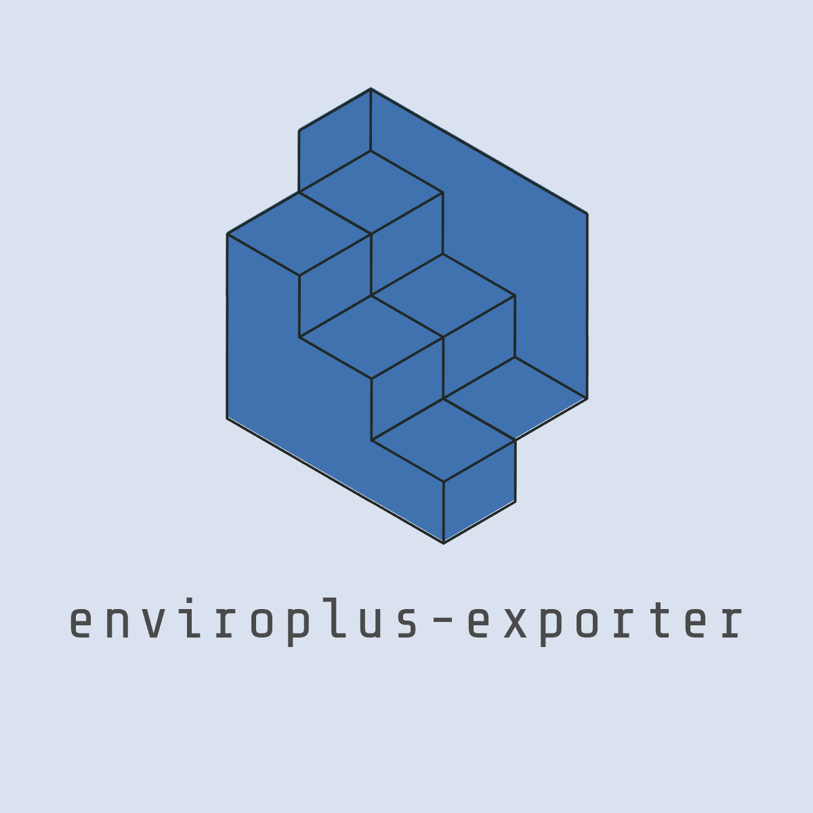
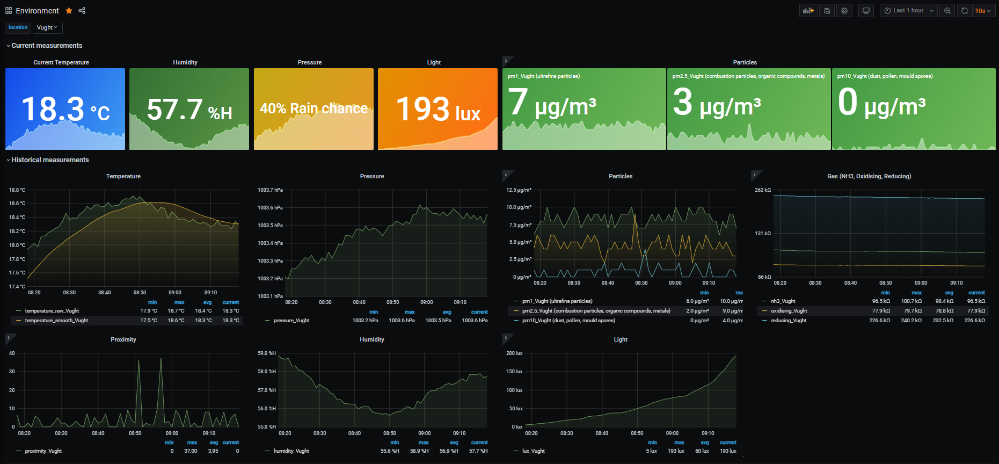
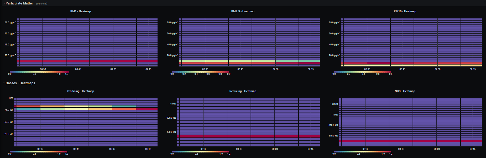

<!--
*** Thanks for checking out this README Template. If you have a suggestion that would
*** make this better, please fork the enviro_exporter and create a pull request or simply open

*** an issue with the tag "enhancement".
*** Thanks again! Now go create something AMAZING! :D
***
***
***
*** To avoid retyping too much info. Do a search and replace for the following:
*** tijmenvandenbrink, enviro_exporter, tijmenvdbrink, email
-->


<!-- PROJECT SHIELDS -->
<!--
*** I'm using markdown "reference style" links for readability.
*** Reference links are enclosed in brackets [ ] instead of parentheses ( ).
*** See the bottom of this document for the declaration of the reference variables
*** for contributors-url, forks-url, etc. This is an optional, concise syntax you may use.
*** https://www.markdownguide.org/basic-syntax/#reference-style-links
-->
[![Contributors][contributors-shield]][contributors-url]
[![Forks][forks-shield]][forks-url]
[![Stargazers][stars-shield]][stars-url]
[![Issues][issues-shield]][issues-url]
[![MIT License][license-shield]][license-url]


<!-- PROJECT LOGO -->
<br />
<p align="center">
  <a href="https://github.com/tijmenvandenbrink/enviro_exporter">
    
  </a>

  <h3 align="center">Enviro-exporter</h3>

  <p align="center">
    Prometheus exporter for enviro module by Pimoroni
    <br />
    <a href="https://github.com/tijmenvandenbrink/enviro_exporter"><strong>Explore the docs »</strong></a>
    <br />
    <br />
    <a href="https://github.com/tijmenvandenbrink/enviro_exporter">View Demo</a>
    ·
    <a href="https://github.com/tijmenvandenbrink/enviro_exporter/issues">Report Bug</a>
    ·
    <a href="https://github.com/tijmenvandenbrink/enviro_exporter/issues">Request Feature</a>
  </p>
</p>


<!-- TABLE OF CONTENTS -->
## Table of Contents

* [About the Project](#about-the-project)
  * [Built With](#built-with)
* [Getting Started](#getting-started)
  * [Prerequisites](#prerequisites)
  * [Installation](#installation)
* [Usage](#usage)
* [Docker](#docker)
* [Roadmap](#roadmap)
* [Contributing](#contributing)
* [License](#license)
* [Contact](#contact)
* [Acknowledgements](#acknowledgements)


<!-- ABOUT THE PROJECT -->
## About The Project

[![Product Name Screen Shot][product-screenshot]](https://github.com/tijmenvandenbrink/enviro_exporter)

### Built With

* [Pimoroni/enviro-python](https://github.com/pimoroni/enviro-python)
* [Prometheus](https://prometheus.io/)
* [Grafana](https://grafana.com/)


<!-- GETTING STARTED -->
## Getting Started

To get the prometheus enviro-exporter up and running I'm assuming you already have Prometheus and Grafana running somewhere. 
***Note***: I wouldn't recommend running Prometheus on a Raspberry Pi (using a local SD card) as this could drastically reduce the lifetime of the SD card as samples are written quite often to disk.

### Prerequisites

- Python3
- To run the enviro-exporter you need to have the enviro-python library by Pimoroni installed:
 
### One-line (Installs enviro-python library from GitHub)

```sh
curl -sSL https://get.pimoroni.com/enviro | bash
```

**Note** Raspbian Lite users may first need to install git: `sudo apt install git curl`

### Installation
 
1.Install the package from pypi
```sh
pip3 install enviro_prometheus_exporter
```

3.Install as a Systemd service
```sh
SERVICE_FILE=https://raw.githubusercontent.com/tijmenvandenbrink/enviro_exporter/master/contrib/enviro-exporter.service
sudo curl ${SERVICE_FILE} -o /etc/systemd/system/enviro-exporter.service
sudo chmod 644 /etc/systemd/system/enviro-exporter.service
sudo systemctl daemon-reload
```
4.Start the enviro-exporter service
```sh
sudo systemctl start enviro-exporter
```
5.Check the status of the service
```sh
sudo systemctl status enviro-exporter
```
If the service is running correctly, the output should resemble the following:

```
pi@raspberrypi:/usr/src/enviro_exporter $ sudo systemctl status enviro-exporter
● enviro-exporter.service - Enviro-exporter service
   Loaded: loaded (/etc/systemd/system/enviro-exporter.service; disabled; vendor preset: enabled)
   Active: active (running) since Fri 2020-01-17 14:13:41 CET; 5s ago
 Main PID: 30373 (python)
    Tasks: 2 (limit: 4915)
   Memory: 6.0M
   CGroup: /system.slice/enviro-exporter.service
           └─30373 /usr/bin/python /usr/src/enviro_exporter/enviro_exporter.py --bind=0.0.0.0 --port=8000

Jan 17 14:13:41 wall-e systemd[1]: Started Enviro-exporter service.
Jan 17 14:13:41 wall-e python[30373]: 2020-01-17 14:13:41.565 INFO     enviro_exporter.py - Expose readings from the Enviro+ sensor by Pimoroni in Prometheus format
Jan 17 14:13:41 wall-e python[30373]: Press Ctrl+C to exit!
Jan 17 14:13:41 wall-e python[30373]: 2020-01-17 14:13:41.581 INFO     Listening on http://0.0.0.0:8000
```

6.Enable at boot time
```sh
sudo systemctl enable enviro-exporter
```
### Usage

eviro-exporter --help for a list of available flags and options:

```sh

Usage: enviro-exporter [OPTIONS]

Options:
  -b, --bind TEXT     Specify alternate bind address [default: 0.0.0.0]
  -p, --port INTEGER  Specify alternate port [default: 8000]
  -f, --factor FLOAT  Factor to compensate temp [default: 2.25]
  -d, --debug         Turns on more verbose logging, prints output [default:
                      False]

  -i, --influxdb      Post sensor data to InfluxDB [default: False]
  -l, --luftdaten     Post sensor data to InfluxDB [default: False]
  -e, --enviro        Set this if you have an Enviro (not Enviro+) so don't
                      have gas and particulate sensors

  -s, --pms           Enable pms5003 data collection [default: False]
  -v, --version       Prints version number and exits [default: False]
  --help              Show this message and exit.

```


## I don't have a pms!

Add the flag `--pms` to your run command if you don't have a pms. This will stop
particulate data collection.

## Enviro users

If you are using an Enviro (not Enviro+) add `--enviro` to the command line (in the `/etc/systemd/system/enviro-exporter.service` file) then it won't try to use the missing sensors.

<!-- USAGE EXAMPLES -->
## Usage

So now we've setup the Prometheus enviro-exporter we can start scraping this endpoint from our Prometheus server and get a nice dashboard using Grafana.  

### Prometheus

If you haven't setup Prometheus yet have a look at the installation guide [here](https://prometheus.io/docs/prometheus/latest/installation/).

Below is a simple scraping config:

```yaml
# Sample config for Prometheus.

global:
  scrape_interval:     15s # By default, scrape targets every 15 seconds.
  evaluation_interval: 15s # By default, scrape targets every 15 seconds.
  # scrape_timeout is set to the global default (10s).

  # Attach these labels to any time series or alerts when communicating with
  # external systems (federation, remote storage, Alertmanager).
  external_labels:
      monitor: 'external'

# Load and evaluate rules in this file every 'evaluation_interval' seconds.
rule_files:
  # - "first.rules"
  # - "second.rules"

# A scrape configuration containing exactly one endpoint to scrape:
# Here it's Prometheus itself.
scrape_configs:
  # The job name is added as a label `job=<job_name>` to any timeseries scraped from this config.
  - job_name: 'prometheus'

    # Override the global default and scrape targets from this job every 5 seconds.
    scrape_interval: 15s
    scrape_timeout: 15s

    # metrics_path defaults to '/metrics'
    # scheme defaults to 'http'.

    static_configs:
    - targets: ['localhost:9090']

  - job_name: node
    # If prometheus-node-exporter is installed, grab stats about the local
    # machine by default.
    static_configs:
    - targets: ['localhost:9100']

    # If environment-exporter is installed, grab stats about the local
    # machine by default.
  - job_name: environment
    static_configs:
    - targets: ['localhost:8000']
      labels:
        group: 'environment'
        location: 'Amsterdam'
        
    - targets: ['newyork.example.com:8001']
      labels:
        group: 'environment'
        location: 'New York'
``` 

I added two labels to the targets ```group: environment``` and ```location: SomeLocation```. The Grafana dashboard uses these labels to distinguish the various locations.

### Grafana

I published the dashboard on [grafana.com](https://grafana.com/grafana/dashboards/11605). You can import this dashboard using the the ID 11605. Instructions for importing the dashboard can be found [here](https://grafana.com/docs/grafana/latest/reference/export_import/).

<p align="center">
  <a href="images/grafana_dashboard_1.png">
    
  </a>
  <a href="images/grafana_dashboard_2.png">
    
  </a>
</p>

### Docker

There is a Dockerfile available if you'd like to run as a docker container.

1.Building

```docker build -t enviro-exporter .```

2.Running

```docker run -d enviro-exporter -d -p 8000:8000 --device=/dev/i2c-1 --device=/dev/gpiomem --device=/dev/ttyAMA0 enviro-exporter```

<!-- ROADMAP -->
## Roadmap

See the [open issues](https://github.com/tijmenvandenbrink/enviro_exporter/issues) for a list of proposed features (and known issues).


<!-- CONTRIBUTING -->
## Contributing

Contributions are what make the open source community such an amazing place to be learn, inspire, and create. Any contributions you make are **greatly appreciated**.

1. Fork the Project
2. Create your Feature Branch (`git checkout -b feature/AmazingFeature`)
3. Commit your Changes (`git commit -m 'Add some AmazingFeature'`)
4. Push to the Branch (`git push origin feature/AmazingFeature`)
5. Open a Pull Request


<!-- LICENSE -->
## License

Distributed under the MIT License. See `LICENSE` for more information.


<!-- ACKNOWLEDGEMENTS -->
## Acknowledgements


<!-- MARKDOWN LINKS & IMAGES -->
<!-- https://www.markdownguide.org/basic-syntax/#reference-style-links -->
[contributors-shield]: https://img.shields.io/github/contributors/tijmenvandenbrink/enviro-exporter
[contributors-url]: https://github.com/tijmenvandenbrink/enviro_exporter/graphs/contributors
[forks-shield]: https://img.shields.io/github/forks/tijmenvandenbrink/enviro-exporter?label=Fork
[forks-url]: https://github.com/tijmenvandenbrink/enviro_exporter/network/members
[stars-shield]: https://img.shields.io/github/stars/tijmenvandenbrink/enviro-exporter
[stars-url]: https://github.com/tijmenvandenbrink/enviro_exporter/stargazers
[issues-shield]: https://img.shields.io/github/issues-raw/tijmenvandenbrink/enviro-exporter
[issues-url]: https://github.com/tijmenvandenbrink/enviro_exporter/issues
[license-shield]: https://img.shields.io/github/license/tijmenvandenbrink/enviro-exporter
[license-url]: https://github.com/tijmenvandenbrink/enviro_exporter/blob/master/LICENSE
[linkedin-shield]: https://img.shields.io/badge/-LinkedIn-black.svg&logo=linkedin&colorB=555
[linkedin-url]: https://linkedin.com/in/tijmenvandenbrink
[product-screenshot]: images/screenshot.png
